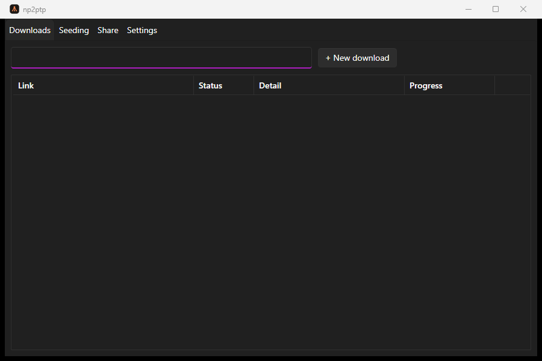

# np2ptp-gui

A Windows desktop app for [np2ptp](https://github.com/LuanBogoqb/np2ptp), a peer-to-peer file transfer tool. Paste a link, pick a folder, watch the progress bar — no terminal, no flags to remember.

Think of it as a small torrent client built around np2ptp instead of BitTorrent: multiple downloads, seeds, and packs running side by side, each with its own row and progress bar.




## What it does

np2ptp-gui doesn't reimplement np2ptp — it drives the real `np2ptp.exe` as a child process and reads its `--json` progress stream, one process per operation. The GUI never touches the network directly and never blocks on one transfer while another is running.

Three tabs map to np2ptp's three operations:

- **Downloads** — fetch something from a `np2ptp:` link.
- **Seeding** — serve a file or folder you already have.
- **Share** — pack a file or folder into a `.nptp` and get a link to send.

Closing the window minimizes to the tray instead of quitting, so an active seed keeps running. "Exit" from the tray icon stops everything cleanly and actually quits.

## Getting it

Grab the latest build from the [Releases page](https://github.com/LuanBogoqb/np2ptp-gui/releases). It downloads and updates its own copy of `np2ptp.exe` on first run, so there's nothing else to install beyond the .NET 8 desktop runtime (Windows 10/11 usually already has it).

## Building from source

Requires the [.NET 8 SDK](https://dotnet.microsoft.com/download/dotnet/8.0).

```
dotnet build Np2ptpGui.sln
dotnet test Np2ptpGui.sln
```

`src/Np2ptpGui` is the app itself; `tests/Np2ptpGui.Tests` covers the pieces that don't need a real np2ptp binary to test (config parsing, the task manager, process handling).

## Themes

Settings has a theme picker: XP Luna (a hand-built homage to the Windows XP look, with a live light/dark switch) and Modern (Fluent-styled, matches your Windows 11 accent color and light/dark setting). Switching takes effect on the next launch.

## A couple of rough edges

This is still an early build. A few things worth knowing:

- The auto-updater checks np2ptp's signing certificate before trusting a downloaded build, and it's picky about it during this transition period — see `docs/` for the full story and how to work around it if you hit it.
- No installer yet, just the exe.
- Cursors, custom UI sounds, and the planned Clippy-style assistant are designed but not built.
