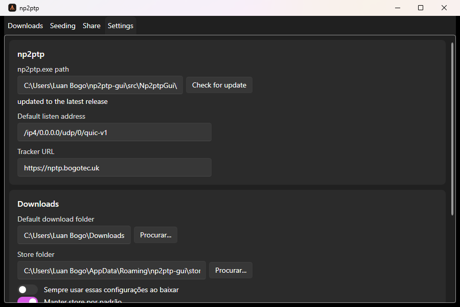

# Themes

Settings has a theme picker with two options. Switching takes effect the next time you launch the app.

## XP Luna

A hand-built homage to the classic Windows XP look — the blue gradients, Tahoma font, the works. It follows your Windows light/dark setting automatically, even while the app is running.

## Modern

A Fluent, Windows 11-styled theme. Picks up your actual Windows accent color and follows the system light/dark setting live, the same as XP Luna does.

